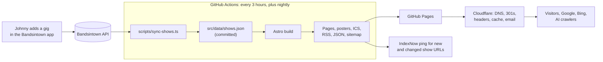

# johnnyrhoades.com v2: build plan

> **Every gig becomes a page, a poster, and proof.**

Johnny Rhoades plays somewhere in Metro Detroit most nights of the week. Today each of those nights leaves almost nothing behind online: a Bandsintown listing and maybe a Facebook post. Version 2 turns the calendar Johnny already keeps into the engine of the whole site. Every public show he enters in the Bandsintown app automatically becomes:

1. **A page** with its own link that people can share and Google can list in event results.
2. **A poster** in the site's own visual style, sized for Instagram, Stories, link previews and a printable flyer.
3. **Proof** for the next booker: a running count of shows, rooms and towns that updates itself.

Johnny's workflow doesn't change. He keeps adding gigs in Bandsintown, and the site rebuilds itself within three hours.

The site is also Joe's portfolio piece. The code, the docs, the decision records and the measured results are part of the product, so they get the same care as the pixels.

**How to use this document.** Sections 1 to 14 are the spec. Section 15 breaks the work into phases with acceptance criteria, sized for Claude Code sessions. Section 17 lists what Johnny needs to confirm; nothing marked unverified ships as fact.

---

## Contents

1. Who the site is for
2. Starting point
3. What gets built, and what doesn't
4. Signature features
5. Architecture
6. Data
7. Page specs
8. Design system
9. SEO
10. GEO and the Johnny Rhoades entity
11. Forms, email and mailing list
12. Quality bars and CI
13. Measurement
14. Launch and migration runbook
15. Build phases
16. Portfolio packaging
17. Questions for Johnny
- Appendix A: Bandsintown naming guide for Johnny
- Appendix B: Structured data examples
- Appendix C: Voice, copy rules and draft bios

---

## 1. Who the site is for

| Audience | What they need in 30 seconds | Where they land |
|---|---|---|
| Talent buyers: bar owners, festival bookers, event planners | Proof he works constantly and delivers, the formats he offers, a fast way to check a date | `/epk/`, `/#book` |
| Fans and locals | Where he's playing tonight and this week, the music, a reason to come out | `/`, `/shows/<show>/` |
| Machines: Google, Bing, ChatGPT, Perplexity, Gemini | One unambiguous artist, facts they can verify elsewhere, structured event data | Every page |

**Success, in one sentence:** more and better bookings, fuller rooms, and a correct answer whenever a person or an AI asks "Who is Johnny Rhoades?"

---

## 2. Starting point

The current one-page prototype (`index.html`, `assets/css/styles.css`, `assets/js/main.js`, `assets/js/strum.js`) is strong. v2 builds on it and does not start over.

**Keep, exactly as they feel today**

- The photography: the hero (blue suit, sunglasses, cream Stratocaster), the ten-photo gallery, the sepia portrait, the album cover.
- The record-and-sleeve album treatment and the strummable guitar neck. They're the site's personality, and they stay the only playful moments on the page.
- The first-person voice on the home page ("Where I'm playing next").
- The video stage with click-to-load facades and self-hosted thumbnails, the lightbox, the skip link, the honeypot fields, and the tracklist with durations and per-track Apple Music links.

**Fix**

| Issue | Why it matters | Where |
|---|---|---|
| Both forms use `data-netlify` | Netlify Forms only work on Netlify. On GitHub Pages, booking requests and signups would silently go nowhere. | Phase 5 |
| Shows load from the Bandsintown JavaScript widget | A third party renders them in the browser: no link per show, no event markup, extra JavaScript, and search engines may not see the dates at all. | Phases 1–2 |
| Structured data is a single `MusicGroup`; `sameAs` lists an album URL; no `Person`, no events | The artist is ambiguous to search engines, and shows can't appear in Google's event results. | Phases 2 and 6 |
| No page for bookers | Bookers want one link they can forward. The home page is written for fans. | Phase 4 |
| Name variants: Johnny Rhoades, John Rhoades Band, Johnny Rhoades Trio, Lucas Rhoades Band | Splits one artist into several weak entities for search and AI. | Phase 6, facts ledger |
| Unverified claim: Detroit Music Award nomination, with no year or category | Fine in Johnny's own voice; risky in press copy and structured data. | Facts ledger |
| Fonts load from Google Fonts | An extra connection on the critical path, and it blocks a strict content security policy. | Phase 0 |
| Typo: "John Nèmeth" | Should be John Németh. | Phase 0 |

---

## 3. What gets built, and what doesn't

A new page has to pass one of two tests: **it builds itself from data Johnny already maintains**, or **it serves an audience the home page can't**. Everything else stays a section on the home page.

| URL | Decision | Reason |
|---|---|---|
| `/` | Keep and upgrade | The pitch. Fans, and every booker's first impression. |
| `/shows/` | Build | All upcoming shows plus the archive. The parent of every show page and the clearest proof of how much he plays. |
| `/shows/<yyyy-mm-dd>-<venue>-<town>/` | Build, generated | One per public show. A link to share, a candidate for Google's event results, local search coverage ("live blues St. Clair Shores"), and the home of its poster. No upkeep. |
| `/epk/` | Build | The link Johnny pastes into every booking email. A different reader, a third-person voice, printable. |
| `/thanks/`, `/404` | Build (utility) | Form confirmation without JavaScript, and a useful dead end. |
| Separate Music, Videos, Photos or About pages | No | One album, four videos and ten photos read better as sections of one page. |
| One page per venue | No | Thin pages. Venue details live on show pages. |
| Weddings and private events page | Not yet | Covered in `/epk/` and the booking form. Revisit if inquiries show real demand. |
| Blog or news | No | Nobody will keep it fed, and a stale news page hurts more than none. |
| `/detroit-blues/` scene guide | Later, conditional | A strong search and AI asset, but only if someone commits to updating it every quarter. |

Generated outputs that aren't pages:

| Output | Purpose |
|---|---|
| `/shows.ics` | Calendar subscription for fans, venues and listing sites |
| `/shows/<show>.ics` | Add a single show to a calendar |
| `/shows/feed.xml` | RSS of newly announced shows, which drives social post drafts and newsletter automation |
| `/shows.json` | Public open data for venues, aggregators and a future iOS widget |
| `/posters/<show>/<format>.png` | Posters (section 4.1) |
| `/sitemap-index.xml`, `/robots.txt`, `/llms.txt`, IndexNow key file | Discovery |

---

## 4. Signature features

The site gets exactly one bold new idea (posters) and three quiet ones. Everything else is restraint.

### 4.1 The poster engine

Every public show gets a typographic gig poster, rendered at build time in the site's own type and colors.

**Why it's worth building.** Johnny plays well over a hundred dates a year, and every venue wants something to post. Today someone makes those graphics by hand, or nobody does. The same images also become each show page's link preview and the images Google asks for in event results.

**Look.** A letterpress show card, the kind blues acts toured on in the '50s and '60s (ADR 0017, which replaced the first, venue-first bill). It's bone stock printed in black and red. A red band reads ★ IN PERSON ★, and JOHNNY RHOADES is set as big as the card allows, on every show, guest spots included. Each line fills the width in whichever Archivo width cut sets it biggest, the way a printer pulled wood type; that fit-to-width behavior is the typographic signature. The act ("Solo acoustic", "Trio", "With Motor City Josh & The Big 3") sits under the name in red. Under a double rule come the venue (fit to width), the town, the date in a red block, and `johnnyrhoades.com`. The PNGs carry the site's paper grain and letterpress wear. There's no photo: no format had room for one without shrinking the name.

**Formats**

| Format | Size | Used for | Generated for |
|---|---|---|---|
| `og` | 1200×630 | Link previews (`og:image`) | Every show page |
| `1x1`, `4x3`, `16x9` | 1200×1200, 1200×900, 1200×675 | `MusicEvent.image` (Google recommends these three ratios) | Upcoming shows |
| `feed` | 1080×1350 | Instagram and Facebook feed posts | Upcoming shows |
| `story` | 1080×1920 | Stories | Upcoming shows |
| Print flyer | US Letter | A print stylesheet on the show page ("Print a flyer") | Upcoming shows |

**How.** `satori` (layout to SVG; templates are plain element objects, not JSX, per ADR 0009) plus `@resvg/resvg-js` (SVG to PNG) in an Astro static endpoint using `getStaticPaths`. Satori accepts TTF, OTF and WOFF but not WOFF2, and it doesn't reliably interpolate variable-font axes, so commit static Archivo instances (for example condensed 800, normal 800, expanded 900 and normal 500) generated with fonttools `varLib.instancer` into `src/assets/fonts/poster/`. Add the print texture with `sharp`. Cache each render by a hash of the template version, the fonts, the textures and the fields it uses, and persist the cache with `actions/cache` so unchanged shows never re-render.

**Acceptance.** The longest venue name in the data fits without overflow in every format. Text contrast passes WCAG AA. Each render stays under 150 ms on a CI runner. Snapshot tests cover five fixtures: a short venue name, a very long one, a guest act, a free show and a cancelled show.

**Accessibility and search.** Every fact on a poster also appears as real text on the page. Poster images get alt text such as "Poster: Johnny Rhoades Trio at Blue Goose Inn, St. Clair Shores, Friday, October 23, 9 pm."

### 4.2 Tonight

On any day Johnny has a show, the home page says so above the fold.

- The home page and show pages embed a small JSON island holding the next ten shows.
- A script of about 1 KB works out "now" in America/Detroit (`Intl.DateTimeFormat` with `timeZone`), treats a show as live until four hours after its start (configurable), and:
  - shows a **Tonight** bar under the hero with venue, town, start time, Directions and RSVP on Bandsintown;
  - hides shows that ended in the hours between rebuilds;
  - on a show page whose date has passed, shows "This show has happened. Next up:" with a link to the next show.
- Without JavaScript, the server-rendered list is still correct as of the last build, and builds run at least nightly.

### 4.3 Proof, counted automatically

Computed from the show history at build time and shown as a plain sentence, not a row of stat cards:

> 112 shows in the last year, in 34 rooms across 19 towns.

It appears on the home page, `/shows/` and `/epk/`, and hides itself when the last year holds fewer than ten shows. `/epk/` also lists his most-played rooms and every festival, generated from the same data.

### 4.4 The 12-bar strum (built, with the bend: ADR 0018)

The strummable neck already plays E7. Let each strum advance through a 12-bar blues in E (E7 for four bars, A7 for two, E7 for two, then B7, A7, E7, B7), with the chord name shown quietly beside the neck. The progression resets after eight seconds without a strum. Sound stays off until the visitor turns it on, and the string vibration respects reduced motion. It's small and on-subject, and it's the kind of detail people send to friends.

The bend: press a string, hold it a moment and push, and it bends up to a whole step, B.B. King's move; wiggle it for vibrato. Holding the up arrow does the same on the B string.

**Rejected:** countdown timers, scroll-triggered animations, page transitions, a chatbot, setlist voting. Each costs attention and gives nothing back to a booker or a fan.

---

## 5. Architecture



| Concern | Choice | Why |
|---|---|---|
| Framework | Astro, static output, TypeScript strict | The existing HTML ports into components almost line for line, ships zero JavaScript by default, builds hundreds of pages quickly, and has a built-in image pipeline. |
| Hosting | GitHub Pages, deployed by Actions | Free, the repo is the portfolio, and deploy history is public. |
| Edge | Cloudflare (free plan) proxying GitHub Pages | Adds what Pages can't do: real 301 redirects, security headers, cache rules, email routing and Turnstile. |
| Show data | Bandsintown API at build time, snapshot committed to the repo | Johnny already keeps it current. Committed history survives API changes, and the commits keep scheduled workflows alive. |
| Dates and times | luxon, zone `America/Detroit` | DST-safe conversion of venue-local times. |
| Posters | satori + @resvg/resvg-js | Templates in JSX, PNGs at build time, no headless browser. |
| Forms | Web3Forms or Formspree at launch, behind a small interface a Cloudflare Worker can replace later | GitHub Pages has no server. |
| Mailing list | Kit or Buttondown | Real list management, a ZIP custom field, RSS-to-email. |
| Analytics | Umami Cloud (cookieless, custom events), Google Search Console, Bing Webmaster Tools | No cookie banner, plus the conversion events the case study needs. |
| Testing | Vitest, Playwright with axe-core, Lighthouse CI, lychee, html-validate | Quality gates that double as portfolio evidence. |
| Editing (optional) | Pages CMS | A friendly editor for bios, facts and quotes on a static GitHub site, with no server to run. |

**GitHub Pages constraints this design works around**

- No server-side redirects and no custom headers. Cloudflare rules handle both (section 14).
- When deploying with a custom Actions workflow, set the custom domain in Settings → Pages; a `CNAME` file is ignored. Jekyll doesn't run, so `_astro/` needs no `.nojekyll`.
- Commits pushed with the default `GITHUB_TOKEN` don't trigger other workflows, so sync, build and deploy are jobs in one workflow.
- Scheduled workflows in public repos are disabled after 60 days without repository activity. The weekly sync heartbeat prevents that (section 6.2).
- Cron schedules run in UTC and can start late under load. Nothing depends on exact timing.

**Repo layout**

```
.
├── CLAUDE.md                  # Working rules for Claude Code
├── PLAN.md                    # This document
├── README.md                  # Portfolio-facing overview
├── astro.config.mjs
├── package.json
├── .github/workflows/
│   ├── site.yml               # sync, build, deploy, IndexNow
│   └── ci.yml                 # Pull request checks
├── docs/
│   ├── decisions/             # Architecture decision records
│   ├── bandsintown-naming.md  # One-pager for Johnny (Appendix A)
│   ├── redirect-map.csv       # Old Bandzoogle URLs to new targets
│   ├── runbook-launch.md
│   ├── geo-audit-log.md       # Monthly AI answer checks
│   └── case-study-notes.md    # Running log for the portfolio write-up
├── public/                    # Copied as-is (IndexNow key, press zip)
├── reference/v1/              # The current prototype, for visual parity
├── scripts/
│   ├── sync-shows.ts
│   ├── indexnow.ts
│   └── make-poster-fonts.py   # Static font instances for satori
├── src/
│   ├── assets/                # Original images, poster fonts
│   ├── components/
│   ├── data/
│   │   ├── shows.json         # Generated by sync, committed
│   │   ├── sync-meta.json
│   │   ├── venues.yaml        # Hand-kept venue details and blurbs
│   │   ├── show-overrides.yaml
│   │   ├── facts.yaml         # The facts ledger
│   │   ├── media.yaml         # Album, tracks, videos, photos, credits
│   │   └── profiles.yaml      # Official profiles (sameAs)
│   ├── layouts/
│   ├── lib/                   # normalize, slug, time, schema, ics, stats, posters
│   ├── pages/
│   ├── scripts/               # Client scripts: tonight, strum, lightbox, forms
│   └── styles/                # tokens.css and component styles
└── tests/
    ├── fixtures/              # Real captured Bandsintown payloads
    ├── unit/
    └── e2e/
```

---

## 6. Data

### 6.1 `shows.json`

```ts
type Act = "solo" | "trio" | "band" | "guest" | "host" | "unspecified";

type Show = {
  id: string;              // Bandsintown event id
  slug: string;            // "2026-10-23-blue-goose-inn-st-clair-shores"
  aliases: string[];       // earlier slugs; each gets a redirect stub
  start: string;           // ISO 8601 with the venue's offset (America/Detroit for Michigan rooms)
  end?: string;            // ISO 8601, when Bandsintown has an end time (ADR 0006)
  act: Act;
  billing: string;         // "Johnny Rhoades Trio", or "Motor City Josh & The Big 3, with Johnny on guitar"
  lineup: string[];
  rawTitle?: string;       // what Johnny typed in Bandsintown
  venue: {
    key: string;           // venues.yaml key
    name: string;
    street?: string;
    city: string;
    region: string;
    postalCode?: string;
    country: string;
    lat?: number;
    lng?: number;
    url?: string;
    timeZone: string;      // IANA zone the times are in; Bandsintown times are venue-local (ADR 0006)
  };
  tickets?: { url?: string; price?: number; free?: boolean };
  bandsintownUrl: string;
  status: "scheduled" | "cancelled" | "postponed" | "rescheduled";
  public: boolean;         // false: no page, no structured data, no poster
  firstSeen: string;       // when sync first saw it; RSS pubDate
  updatedAt: string;       // last material change; sitemap lastmod
  sequence: number;        // bumps on material change; ICS SEQUENCE
};
```

### 6.2 Sync rules (`scripts/sync-shows.ts`)

1. Fetch `https://rest.bandsintown.com/artists/id_11869348/events?app_id=…&date=upcoming` and the same with `date=past`. The `app_id` comes from Johnny's Bandsintown for Artists account settings and lives only in the Actions secret `BANDSINTOWN_APP_ID`.
2. **Capture before you model.** On the first run, save the raw responses to `tests/fixtures/` and write the normalizer against the real fields. Confirm rather than assume: how the start time is expressed (believed to be venue-local with no UTC offset), where Johnny's typed title lives, and whether free or price information comes through.
3. Normalize and merge by `id` into the existing file. Never delete history.
4. An upcoming show that disappears from the API is removed from the site, unless `show-overrides.yaml` marks it `cancelled`. Then its page stays up with `eventStatus: EventCancelled`, because Google asks that cancelled events keep their markup rather than vanish.
5. **Guard.** If the API errors, or returns zero upcoming shows while the stored data holds three or more future shows, fail the job and commit nothing. GitHub sends a failure notification.
6. A material change (date, time, venue, act or status) bumps `sequence` and `updatedAt`. A slug change moves the old slug into `aliases`.
7. Commit only when something changed, with a message such as `chore(shows): sync +2 new, 1 updated`.
8. **Heartbeat.** Once a week, update `sync-meta.json` and commit it, so a quiet stretch on the calendar never leaves the repo 60 days without activity.
9. After deploy, send new and changed show URLs to IndexNow.

**Act inference.** Overrides always win.

The label is the Bandsintown title, or, since Johnny has never used titles, the part of the venue name before "@" ("Solo Acoustic @ The Whiskey Six"). ADR 0020 has the details and his real wordings.

| Signal in the label or lineup | Act |
|---|---|
| "host", "open mic" | `host` |
| "with …", "w/ …", a name ending in Band, Duo or Trio, another name next to his, Motor City Josh, or a lineup led by another artist | `guest` |
| "trio" | `trio` |
| "band", "full band" | `band` |
| "solo", "acoustic" | `solo` |
| None of the above | `unspecified`, billed as plain "Johnny Rhoades" (no default act; ADR 0020) |

### 6.3 Hand-kept overrides

```yaml
# src/data/venues.yaml
blue-goose-inn:
  match: ["Blue Goose Inn", "The Blue Goose"]
  name: Blue Goose Inn
  street: 28911 Jefferson Ave
  city: St. Clair Shores
  region: MI
  postalCode: TODO
  url: TODO
  blurb: >-
    TODO: one or two specific sentences about the room, confirmed with Johnny.
```

Write blurbs for the fifteen most-played rooms only. They give every show page something specific and useful, which is what keeps a few hundred generated pages from reading as thin.

```yaml
# src/data/show-overrides.yaml
"108445076":            # Ann Arbor State Street Art Fair, July 16, 2026
  act: guest
  billing: "Jill Jack, with Johnny Rhoades"
```

### 6.4 The facts ledger (`facts.yaml`)

Every biographical claim on the site comes from here, with a status and, wherever possible, a source.

```yaml
- id: started-with-motor-city-josh
  claim: "Started out at 19 playing in Motor City Josh's band."
  status: confirmed_by_johnny     # verified | confirmed_by_johnny | unverified
  sources:
    - url: http://jbblues.blogspot.com/2010/11/motor-city-josh.html
      note: "2010 post lists Johnny Rhoades on guitar and vocals in Motor City Josh's quartet"

- id: antifreeze-festival
  claim: "Played the Detroit Blues Society's Anti-Freeze Blues Festival."
  status: verified
  sources:
    - url: https://www.ferndalefriends.net/the-23rd-detroit-blues-society-anti-freeze-blues-festival/

- id: detroit-music-award-nomination
  claim: "Nominated for a Detroit Music Award."
  status: unverified
  needs: "Year and category from Johnny, plus a link to the listing"
```

Rules, enforced by a check script in CI:

- The home page, written in Johnny's own voice, may use `verified` and `confirmed_by_johnny` facts.
- `/epk/` may use `verified` and `confirmed_by_johnny` facts, and shows the source link when there is one.
- Structured data may use `verified` facts only.
- `unverified` facts appear nowhere until they're resolved.

### 6.5 Media and profiles

- `media.yaml` holds the album (released 2014-11-02, ten tracks with durations for `MusicRecording`), the four videos (YouTube ID, title, context, plus upload date and duration filled in once), and every photo (file, alt text, photographer credit, license, and where it may be used: `gallery`, `epk`, `poster:solo`, `poster:band`).
- `profiles.yaml` holds each official profile with a status of `live`, `to_claim` or `to_create`. Only `live` profiles render as links or go into `sameAs`.

---

## 7. Page specs

### 7.1 Home `/`

The section order stays the same: hero, shows, music, videos, about, photos, booking, mailing list, footer.

| Section | Changes |
|---|---|
| Head | Title `Johnny Rhoades \| Blues Guitarist and Singer, Detroit`. A meta description that names the formats and the region. The site-wide JSON-LD graph (Appendix B). Self-hosted fonts. |
| Hero | Keep the photo and logo. Add one visible line of text under the logo in Johnny's voice, such as "Blues guitar and vocals from Detroit. Solo, trio, or full band." Add the Tonight bar slot. |
| Proof line | The sentence from section 4.3, between the hero and the shows. |
| Shows | Replace the widget with the next eight shows rendered at build time: date, venue, town, act label and start time, each linking to its show page. Then "All shows", "Subscribe to the calendar" and "Follow on Bandsintown". |
| Music | Keep the record and the strum. Point Apple Music at the artist page as well as the album. Add Spotify once it's claimed. Add `MusicAlbum` with `MusicRecording` tracks from `media.yaml`. |
| Videos | Keep. Add `VideoObject` data for each video. |
| About | Keep the voice. Pull claims from the ledger. Fix Németh. |
| Photos | Keep. Add photographer credits to the lightbox captions. |
| Booking | Keep the form and move it to the new backend (section 11). Add an Act select and an optional budget range. Add "Booking agent or festival? See the press kit" linking to `/epk/`. Add a response-time promise once Johnny confirms one he can keep. |
| Mailing list | Keep the copy and the ZIP field. Move it to the email service. |
| Footer | Links from `profiles.yaml`. A small "Site by Joe" credit, with Johnny's OK. |

### 7.2 Show page `/shows/<slug>/`

```
┌─────────────────────────────────────────────────────────┐
│ Shows / Blue Goose Inn, Oct 23                          │
├────────────────────────┬────────────────────────────────┤
│                        │ Johnny Rhoades Trio            │
│                        │ at Blue Goose Inn              │
│     Poster (4:5)       │ Friday, October 23, 9 pm       │
│                        │ 28911 Jefferson Ave,           │
│                        │ St. Clair Shores, MI           │
│                        │ [Directions] [Add to calendar] │
│                        │ [RSVP on Bandsintown]          │
│                        │ Cover or ticket line           │
├────────────────────────┴────────────────────────────────┤
│ About the room: venue blurb, "played here 14 times"     │
├─────────────────────────────────────────────────────────┤
│ Promote this show: [Instagram post] [Story] [Flyer]     │
├─────────────────────────────────────────────────────────┤
│ Next up: three upcoming shows                           │
├─────────────────────────────────────────────────────────┤
│ Booking your room? See the press kit                    │
└─────────────────────────────────────────────────────────┘
```

On phones the details come first and the poster follows.

- **States:** upcoming; tonight (client-side); past (a client-side banner until the nightly build); cancelled (a banner plus `EventCancelled` markup).
- **Add to calendar:** a Google Calendar template link plus the per-show `.ics` file.
- **Directions:** a Google Maps search URL built from the venue name and address. No embedded map.
- **Venue history:** "Johnny's played here 14 times since 2024", computed from the data.
- **Lifecycle:** a page exists from the moment a show is announced. Thirty days after the date it switches to `noindex, follow` and leaves the sitemap, but stays online so links in old posts keep working. Shows dated more than 30 days before launch get no page at all; they appear only in the `/shows/` archive and in the counts.
- **Search:** title `Johnny Rhoades Trio at Blue Goose Inn, St. Clair Shores | Fri Oct 23, 2026`, a description built from act, venue, town, date and time, a canonical URL, the `og` poster as `og:image`, and JSON-LD `MusicEvent` plus `BreadcrumbList`.

### 7.3 Shows `/shows/`

- The proof sentence, then upcoming shows grouped by month.
- Subscribe to the calendar, follow on Bandsintown, and an RSS link.
- The archive grouped by year in collapsed `<details>` elements, newest first, with date, venue, town and act. Rows link only where a show page exists.
- JSON-LD: an `ItemList` of upcoming show pages.

### 7.4 Press kit `/epk/`

Written in the third person for people who book music. Everything above the fold answers two questions: is he worth a slot, and how do I book him?

1. Name, a one-line description, booking email, phone if Johnny wants it listed, and "Download press photos".
2. The best live video.
3. The proof sentence, his most-played rooms and festivals (generated).
4. Formats: solo acoustic, trio, full band. For each: typical set length, what he brings, what he needs, and a stage plot and input list.
5. Bios in three lengths (about 50, 150 and 350 words), each with a Copy button.
6. Fast facts: short, declarative, sourced sentences (section 10).
7. Highlights and credits from the facts ledger, with source links.
8. Press quotes, once there are real ones.
9. Photos: six selects with credits and high-resolution downloads, a zip of all of them, and logo files for light and dark backgrounds.
10. Private events: weddings, corporate events and parties, what's included and how to ask.

A print stylesheet turns the page into a clean two-page one-sheet. Title: `Johnny Rhoades Press Kit | Detroit Blues Guitarist for Venues, Festivals and Events`.

### 7.5 Utility pages

- `/thanks/`: confirmation for form posts made without JavaScript, with a link back to the shows. `noindex`.
- `404.html`: "That page isn't here." The next three shows, plus links to all shows, the press kit and the home page.

---

## 8. Design system

The v1 visual language is the brand. v2 documents it and tightens it, and adds no new ideas beyond the poster.

- **Tokens.** Extract the colors, type scale, spacing and radii from `styles.css` into `src/styles/tokens.css`: the near-black ground, the cream text, the red accent. New colors or typefaces need a decision record.
- **One thing to explore.** The hero photo's blue suit. A deep suit blue as a secondary color would tie the palette to Johnny himself and to the word "blues", and give the red a partner. Try it on the poster first, and adopt it only if it earns its place.
- **Type.** Archivo, self-hosted as a variable font with weight and width axes, subset to Latin. Display headings wide and heavy, dates and times condensed, body text at normal width. Posters use static instances (section 4.1).
- **Motion.** The record and the strum are the only playful motion. No scroll-triggered reveals and no hover animations on every card. Respect `prefers-reduced-motion` everywhere.
- **Imagery.** Full-color photos on the site; posters are type only (ADR 0017). Every photo has real alt text and a credit.
- **Components.** Header, Hero, TonightBar, ProofLine, ShowRow, ShowList, ShowPoster, AddToCalendar, AlbumRecord, StrumNeck, VideoStage, Gallery and Lightbox, BookingForm, MailingList, Breadcrumbs, JsonLd, Footer.

---

## 9. SEO

| Page | Title template | Description template |
|---|---|---|
| Home | `Johnny Rhoades \| Blues Guitarist and Singer, Detroit` | Formats, region, and "see upcoming shows or book him" |
| Shows | `Johnny Rhoades Shows \| Live Blues in Metro Detroit` | The number of upcoming shows and the next date |
| Show | `{Billing} at {Venue}, {Town} \| {Day Mon D, YYYY}` | `{Act} blues at {Venue} in {Town}, {date} at {time}. {Cover line}` |
| Press kit | `Johnny Rhoades Press Kit \| Detroit Blues Guitarist for Venues, Festivals and Events` | Formats and how to book |

- **Canonicals and URLs.** The apex domain `https://johnnyrhoades.com`, trailing slashes everywhere (`trailingSlash: "always"`, `build.format: "directory"`), and `www` redirecting to the apex.
- **Sitemap.** Home, `/shows/`, `/epk/`, and show pages from announcement until 30 days after the show, each with `lastmod` taken from `updatedAt`. Excludes `/thanks/` and the 404 page.
- **robots.txt.** Allow everything, including AI crawlers (GPTBot, ClaudeBot, PerplexityBot, Google-Extended), and point to the sitemap.
- **Structured data.** A site-wide graph of `WebSite`, `Person` (Johnny), `MusicGroup` (the band) and `MusicAlbum` (Appendix B). A `MusicEvent` on every public show page with a `Place` and full `PostalAddress`, `performer`, `organizer`, `eventStatus`, `eventAttendanceMode`, the three poster ratios as `image`, and `offers` only when a price or ticket link is known (price `0` for free shows). Never mark up private events: Google only accepts events the public can attend.
- **FAQ.** Keep a short FAQ on `/epk/` as plain content, because answer engines quote it. Don't add `FAQPage` markup expecting rich results; Google stopped showing FAQ rich results in May 2026.
- **Google Business Profile.** Skip it. Google's guidelines list artists as ineligible.
- **Internal links.** Home to the next shows, show pages to "Next up" and `/shows/`, and every show page to `/epk/`.
- **Search engines.** Verify the Google Search Console domain property now, before migration; Search Console shows past data once verified, so this becomes the baseline. Add Bing Webmaster Tools, since Bing's index feeds Copilot and is widely reported to feed ChatGPT search. Ping IndexNow on every deploy.

---

## 10. GEO and the Johnny Rhoades entity

Answer engines describe the artists they can identify with confidence and verify elsewhere. The work here is making Johnny one clear, well-corroborated entity.

- **Canonical name:** Johnny Rhoades. `alternateName`: John Rhoades.
- **Groups.** Johnny Rhoades Band and Johnny Rhoades Trio as `MusicGroup`s with Johnny as `member`. Motor City Josh & The Big 3 and the Lucas Rhoades Band as `memberOf` roles with `roleName` and dates, once Johnny confirms them.
- **`sameAs`.** Only live, official profiles from `profiles.yaml`.

| Profile | Status today | Action |
|---|---|---|
| Bandsintown (`/a/11869348`) | Live | Keep |
| YouTube (`@johnnyrhoades86`) | Live | Keep, and check eligibility for an Official Artist Channel |
| Apple Music | Album page only | Add the artist page URL and claim Apple Music for Artists |
| Amazon | Album page | Add the artist page if one exists |
| Facebook | Numbered personal-style profile | Create a named artist page and move over |
| Spotify | Not found | Claim Spotify for Artists |
| Instagram | Not found | Create a matching handle |
| MusicBrainz | Missing | Create artist and release entries |
| Discogs | Missing | Create entries, including his guitar credits on Motor City Josh albums |
| Wikidata | Missing | Create once there are independent references |

- **Fast facts on `/epk/`.** Short declarative sentences built only from `verified` or `confirmed_by_johnny` facts. For example: "Johnny Rhoades is a blues guitarist and singer from Detroit, Michigan. He started at 19 in Motor City Josh's band. His album *Waiting on the Sun* came out in 2014." The show count comes from data.
- **`/llms.txt`.** Generated from the ledger and profiles: who Johnny is, the canonical URLs, how to book. Five minutes of work; don't count on it.
- **Earned mentions, the part that matters most.** A Detroit Blues Challenge entry, a pitch to WDET's *Jay's Place*, a Metro Times listing or feature, festival lineup pages, and a link to the WDIV *Live in the D* segment if one exists online. Each becomes a `verified` fact with a source.
- **Monthly audit.** Ask ChatGPT, Perplexity, Gemini and Google AI Mode the same five questions: "Who is Johnny Rhoades?", "Detroit blues guitarists for hire", "Where is Johnny Rhoades playing this week?", "What album did Johnny Rhoades release?" and "Who has Johnny Rhoades played with?" Log the results in `docs/geo-audit-log.md` and fix errors at the source profile, not on the site.

---

## 11. Forms, email and mailing list

**Booking form**

- Fields: name, email, phone (optional), date, venue and town, event type, act (solo acoustic, trio, full band, not sure), budget range (optional), details.
- Delivery: Web3Forms or Formspree at launch, called from `src/lib/forms.ts` so a Cloudflare Worker with Turnstile can replace it later without touching the markup. Keep the honeypot.
- Email subject: `Booking: {date}, {venue/town}, {event type}`, so Johnny can triage from his phone.
- States: an inline success message with JavaScript, `/thanks/` without. Errors say what went wrong and offer the booking email as a fallback.

**Email address**

- `hello@johnnyrhoades.com`, Johnny's work email on Zoho Mail, is the booking email: in the booking section, the form's error messages, the press kit and `llms.txt` (ADR 0021). No new address, and no Cloudflare Email Routing, which would replace Zoho's MX records (ADR 0013).

**Mailing list**

- Export the list from Bandzoogle before anything else changes.
- Move to Kit or Buttondown. Keep the ZIP field and map it to a region tag (Metro Detroit, Ann Arbor, Lansing, West Michigan, out of state) so announcements can target people nearby.
- Optional: RSS-to-email from `/shows/feed.xml` for an automatic weekly "where I'm playing" email.

---

## 12. Quality bars and CI

| Area | Bar |
|---|---|
| Core Web Vitals (mobile) | LCP ≤ 2.0 s, CLS ≤ 0.05, INP ≤ 150 ms |
| Lighthouse (mobile) on `/`, a show page and `/epk/` | Performance ≥ 95; Accessibility, Best Practices and SEO at 100 |
| JavaScript | Home ≤ 30 KB gzipped before interaction. The strum loads when it scrolls into view, and audio starts only after the visitor turns sound on. |
| Page weight | Home first view ≤ 600 KB, excluding video |
| Accessibility | WCAG 2.2 AA. Keyboard access for the strum, lightbox, video stage and forms. Visible focus. Reduced motion respected. |
| Security headers (via Cloudflare) | HSTS; a Content-Security-Policy that allows only YouTube (nocookie) frames, the form endpoint and analytics; `Referrer-Policy: strict-origin-when-cross-origin`; `X-Content-Type-Options: nosniff`; a tight `Permissions-Policy` |
| Caching (via Cloudflare) | `/_astro/*` for one year, immutable; HTML short |

**CI on every pull request (`ci.yml`)**

- `astro check` and TypeScript strict mode.
- Unit tests: the normalizer against captured fixtures; slugs stable and unique; time conversion across the DST changes (November 1, 2026 and March 14, 2027); ICS output that parses; structured data builders that produce the required fields (validated with Zod); the facts-ledger rules.
- Playwright: home renders shows from fixtures, show pages carry a valid `MusicEvent`, forms validate, no console errors, and axe-core reports no serious or critical issues.
- Lighthouse CI against the budgets above.
- html-validate.
- lychee link check, run weekly and non-blocking for external links.

**Deploy (`site.yml`)**

- Triggers: push to `main`, manual dispatch, a schedule every three hours, and a nightly schedule. Use `github.event.schedule` to tell the two schedules apart: the three-hourly run deploys only when the sync changed something, and the nightly run always rebuilds so past shows roll off.
- Jobs: sync (commit if changed), build (restore the poster cache), deploy with the official Astro and Pages actions (check the Astro docs for current versions), then IndexNow.
- Permissions: `contents: write`, `pages: write`, `id-token: write`, plus a concurrency group so runs never overlap.

---

## 13. Measurement

Capture the baseline before launch. The portfolio case study depends on it.

| Metric | Baseline (capture now) | Target | Source |
|---|---|---|---|
| Booking inquiries per month | Ask Johnny for the last three months | A meaningful rise within six months; set the number once the baseline is known | Form delivery, Umami event |
| Public shows with valid event markup | 0% | 100% | CI and the Search Console enhancement report |
| Non-branded search impressions ("detroit blues", town plus "live blues") | Search Console | Growing month over month | Search Console |
| Show page shares and poster downloads | None | Tracked from launch | Umami events |
| AI answer accuracy (five questions, four engines) | Audit before launch | 16 of 20 accurate within six months | `geo-audit-log.md` |
| Core Web Vitals | Lighthouse on the current Bandzoogle site | All green | Search Console, Lighthouse CI |
| Mailing list size | Bandzoogle export count | Growing | Email service |

Custom events: `booking_submit`, `booking_error`, `list_signup`, `poster_download` (with format), `calendar_add`, `calendar_subscribe`, `directions_click`, `rsvp_click`, `ticket_click`, `video_play`, `strum_sound_on`, `email_click` (with where; ADR 0021).

---

## 14. Launch and migration runbook

**Before launch**

1. Get access to the domain registrar, the Bandzoogle account and the Bandsintown for Artists account.
2. Export from Bandzoogle: the mailing list, audio files, photos and any store data. Record every DNS record currently on the domain, including any MX records for email.
3. Crawl the current site and list every URL (`/home`, `/music`, track pages, anything in its sitemap) in `docs/redirect-map.csv` with its new target.
4. Verify the Search Console domain property with a DNS TXT record now, to start the baseline.
5. Move DNS to Cloudflare and recreate every existing record, still pointing at Bandzoogle. Lower the TTLs.
6. Verify the domain in GitHub (account settings, Pages, verified domains) to prevent takeover.

**Staging**

7. Set `new.johnnyrhoades.com` as the Pages custom domain. Run the whole site there with `noindex` and review it on real phones.

**Cutover**

8. Switch the Pages custom domain to `johnnyrhoades.com`. Apex A records: `185.199.108.153`, `185.199.109.153`, `185.199.110.153`, `185.199.111.153`. AAAA records: `2606:50c0:8000::153`, `2606:50c0:8001::153`, `2606:50c0:8002::153`, `2606:50c0:8003::153`. A `www` CNAME to `<user>.github.io`. Keep them DNS-only (grey cloud) until GitHub issues the certificate, then turn on Enforce HTTPS.
9. Turn on the Cloudflare proxy with SSL mode Full (strict). If GitHub later reports certificate trouble, switch to DNS-only briefly while it renews.
10. Add Cloudflare redirect rules (`www` to the apex, then every row of the redirect map, for example `/home` to `/` and `/music` to `/#music`), the security headers and the cache rule.
11. Remove `noindex`. Submit the sitemap to Search Console and Bing Webmaster Tools. Ping IndexNow.

**After launch**

12. Check every old URL with `curl -I` and confirm a 301 to the right target. Test two show pages in Google's Rich Results Test. Subscribe to `/shows.ics` in Apple and Google Calendar. Send a test booking and a test signup.
13. Keep Bandzoogle active for 30 days as a rollback, then cancel it once the domain and exports are confirmed safe.

---

## 15. Build phases

Each phase is sized for one or two Claude Code sessions and ends with acceptance criteria. Don't start a phase until the previous one passes.

**Phase 0: Scaffold with visual parity**

- Create the Astro project and copy the current prototype (HTML, CSS, JS and images) into `reference/v1/`.
- Port the page into layouts and components with no visible change. Move images into `src/assets/` for the image pipeline, self-host Archivo, and fix Németh.
- Deploy to GitHub Pages on the staging domain.
- Acceptance: Playwright screenshots match `reference/v1/` at 390, 768 and 1440 px within a small tolerance. Lighthouse scores are at least as good as v1. A push to `main` deploys green.

**Phase 1: Show data pipeline**

- Capture real Bandsintown fixtures. Write `normalize`, `slug`, `time` and the sync script with the guard, merge, overrides and heartbeat. Write `site.yml`.
- Acceptance: `npm run sync` with the secret produces a valid `shows.json`. Unit tests pass, including the DST edges. The workflow commits only on change, and the guard blocks an empty upcoming list.

**Phase 2: Shows on the site**

- The home shows section rendered at build time, the Tonight bar, the proof sentence, `/shows/`, show pages, per-show and site-wide ICS, RSS, `/shows.json`, and the structured data graph.
- Acceptance: Google's Rich Results Test accepts two sample show pages (a manual check, with screenshots saved to `docs/`). ICS subscriptions work in Apple and Google Calendar. Past shows hide client-side between builds. No Bandsintown widget JavaScript remains.

**Phase 3: Poster engine**

- Static font instances, templates, duotone photos, the formats from section 4.1, caching, download buttons, the print flyer, and `og:image` wiring.
- Acceptance: snapshot tests pass for the five fixtures. Cached rebuilds skip unchanged posters. Link previews render correctly in iMessage, Facebook and Slack.

**Phase 4: Press kit and facts ledger**

- `facts.yaml`, `media.yaml`, `profiles.yaml`, the CI check for ledger rules, and `/epk/` with bios, fast facts, formats, stage plots, downloads and print styles.
- Acceptance: every claim on `/epk/` maps to a ledger entry with an allowed status. The page prints to two pages. The photo zip and logo downloads work.

**Phase 5: Forms, email, list and analytics**

- Move both forms off Netlify, deliver bookings to Johnny's work email, connect the email service with ZIP tags, and add Umami with the custom events.
- Acceptance: a test booking reaches Johnny's inbox with the right subject line. A signup lands in the email service with its region tag. Events show up in Umami.

**Phase 6: Hardening**

- Lighthouse CI budgets, axe, html-validate, lychee, sitemap rules, robots, `llms.txt`, IndexNow, and the CSP draft.
- Acceptance: all CI gates are green on `/`, a show page and `/epk/`.

**Phase 7: Launch**

- Run section 14.
- Acceptance: every row of the redirect map returns a 301 to the right target. Search Console and Bing accept the sitemap. The rollback path is documented.

**Phase 8: After launch (30, 60 and 90 days)**

- The profile claims and database entries from section 10, monthly AI audits, metric check-ins and the case study.
- Optional: the 12-bar strum (done early, ADR 0018), Pages CMS, the weekly RSS email, and a Cloudflare Worker for forms.

---

## 16. Portfolio packaging

- **README.** A screenshot, the one-line idea, the architecture diagram, how Johnny uses it (Bandsintown only), Lighthouse scores, links to the decision records, and licensing: code under MIT; photos and music all rights reserved by their owners.
- **Decision records** in `docs/decisions/`: GitHub Pages behind Cloudflare; Bandsintown as the source of truth with committed snapshots; build-time posters; the facts ledger; which pages earn their place; skipping Google Business Profile.
- **Case study outline.** The problem, the constraints (a working musician who won't touch a CMS, and a free host), the approach, the build, the results at 30, 60 and 90 days, and what's next.
- **Capture as you go** in `docs/case-study-notes.md`: before-and-after screenshots, Lighthouse before and after, a screen recording of a gig added in Bandsintown going live as a page and poster, a grid of generated posters, and AI answers before and after.
- **A stretch idea that fits Joe's background:** an iOS home-screen widget showing Johnny's next show, reading `/shows.json`.

---

## 17. Questions for Johnny

Nothing below ships as fact until he answers.

- [x] Detroit Music Award nomination: year and category. Resolved by research (2026-10-02): he won Outstanding Blues Artist/Group in 2020 and 2023 with Motor City Josh & The Big 3, and still plays in the band. His bio's older "nominee" line is superseded.
- [ ] B.B. King memorial celebration in Memphis: date and venue. Lead: the May 27, 2015 tribute at W.C. Handy Park, with John Németh, as Joe thinks.
- [ ] Touring in Europe, Mexico and the Caribbean: where, when and with whom. Europe was with John Németh's band, per Joe. Years?
- [ ] John Németh's Blue Dreamers: which years, and any other records with Németh besides *Feelin' Freaky* (2017).
- [ ] Brett Lucas's *Soul and Courage* (Detroit Music Award, 2020): is he on it, which volume and which tracks?
- [ ] The Blue Goose story: did he start there washing dishes?
- [ ] Lucas Rhoades Band: current or past, and how it should be billed. Bandsintown has 19 shows billed that way, the latest at The Fed in August 2026; the site says "Lucas Rhoades Band, with Johnny Rhoades" for now.
- [ ] Years in Motor City Josh's band, and which albums he's on.
- [ ] Formats: who plays in the trio and the band, typical set lengths, and whether he brings his own PA, and for what size room.
- [x] A default act for Bandsintown entries with no label. Not needed: unlabeled shows are billed as plain "Johnny Rhoades", and the act is read from the label he already types in front of the venue name (ADR 0020).
- [x] Which booking email to publish. Answered 2026-10-05: `hello@johnnyrhoades.com`, his work email (ADR 0021).
- [ ] Whether to publish a phone number, and a response time he can keep.
- [ ] Original high-resolution files and photographer credits for every photo.
- [ ] A stage plot and input list for each format.
- [ ] Access to Spotify for Artists and Apple Music for Artists, and who distributed *Waiting on the Sun*.
- [ ] Registrar, Bandzoogle and Bandsintown logins, and any email currently running on the domain.
- [ ] Two or three venue owners or bookers who'd give a one-line quote.
- [ ] OK to make the repo public and to add a "Site by Joe" credit.

---

## Appendix A: Bandsintown naming guide for Johnny

Keep this on your phone. The current version is `docs/bandsintown-naming.md`; it no longer asks Johnny to type a title (ADR 0020).

Add shows the way you always have. Three things help: pick the venue from Bandsintown's list when it's there, set the start time, and leave private gigs out. Saying who's playing is optional, in the title or in front of the venue name ("Solo Acoustic @ The Whiskey Six"), in his own words. Unlabeled shows are billed as Johnny Rhoades.

---

## Appendix B: Structured data examples

**Site-wide graph, on every page**

```json
{
  "@context": "https://schema.org",
  "@graph": [
    {
      "@type": "WebSite",
      "@id": "https://johnnyrhoades.com/#website",
      "url": "https://johnnyrhoades.com/",
      "name": "Johnny Rhoades",
      "publisher": { "@id": "https://johnnyrhoades.com/#johnny" }
    },
    {
      "@type": "Person",
      "@id": "https://johnnyrhoades.com/#johnny",
      "name": "Johnny Rhoades",
      "alternateName": ["John Rhoades"],
      "description": "Blues guitarist and singer from Detroit, Michigan.",
      "jobTitle": "Blues guitarist and singer",
      "url": "https://johnnyrhoades.com/",
      "image": "TODO: absolute URL of the portrait",
      "homeLocation": { "@type": "Place", "name": "Detroit, Michigan" },
      "sameAs": [
        "https://www.bandsintown.com/a/11869348",
        "https://www.youtube.com/@johnnyrhoades86",
        "https://www.facebook.com/profile.php?id=100085365311010"
      ]
    },
    {
      "@type": "MusicGroup",
      "@id": "https://johnnyrhoades.com/#band",
      "name": "Johnny Rhoades Band",
      "genre": "Blues",
      "url": "https://johnnyrhoades.com/",
      "member": { "@id": "https://johnnyrhoades.com/#johnny" }
    },
    {
      "@type": "MusicAlbum",
      "@id": "https://johnnyrhoades.com/#waiting-on-the-sun",
      "name": "Waiting on the Sun",
      "datePublished": "2014-11-02",
      "numTracks": 10,
      "byArtist": { "@id": "https://johnnyrhoades.com/#johnny" },
      "url": "https://music.apple.com/us/album/waiting-on-the-sun/942326904"
    }
  ]
}
```

**Show page.** Include `offers` only when a price or ticket link is known; this example assumes a free show.

```json
{
  "@context": "https://schema.org",
  "@type": "MusicEvent",
  "name": "Johnny Rhoades Trio at Blue Goose Inn",
  "url": "https://johnnyrhoades.com/shows/2026-10-23-blue-goose-inn-st-clair-shores/",
  "startDate": "2026-10-23T21:00:00-04:00",
  "eventStatus": "https://schema.org/EventScheduled",
  "eventAttendanceMode": "https://schema.org/OfflineEventAttendanceMode",
  "location": {
    "@type": "Place",
    "name": "Blue Goose Inn",
    "address": {
      "@type": "PostalAddress",
      "streetAddress": "28911 Jefferson Ave",
      "addressLocality": "St. Clair Shores",
      "addressRegion": "MI",
      "postalCode": "TODO",
      "addressCountry": "US"
    }
  },
  "performer": {
    "@type": "MusicGroup",
    "name": "Johnny Rhoades Trio",
    "member": { "@id": "https://johnnyrhoades.com/#johnny" }
  },
  "organizer": { "@type": "Organization", "name": "Blue Goose Inn" },
  "image": [
    "https://johnnyrhoades.com/posters/2026-10-23-blue-goose-inn-st-clair-shores/1x1.png",
    "https://johnnyrhoades.com/posters/2026-10-23-blue-goose-inn-st-clair-shores/4x3.png",
    "https://johnnyrhoades.com/posters/2026-10-23-blue-goose-inn-st-clair-shores/16x9.png"
  ],
  "description": "Johnny Rhoades Trio plays blues at Blue Goose Inn in St. Clair Shores.",
  "offers": {
    "@type": "Offer",
    "url": "https://johnnyrhoades.com/shows/2026-10-23-blue-goose-inn-st-clair-shores/",
    "price": "0",
    "priceCurrency": "USD",
    "availability": "https://schema.org/InStock"
  }
}
```

---

## Appendix C: Voice, copy rules and draft bios

**Voice**

- Home page: first person, Johnny talking, short sentences ("Where I'm playing next").
- Press kit and structured data: third person, factual.
- Sentence case for headings and buttons. Buttons say what happens: "Send booking request", "Download Instagram post".
- Specific beats superlative: names, rooms, dates and counts. These words don't appear: soulful, electrifying, legendary, powerhouse, world-class, "Detroit's best".
- No claim without a ledger entry.

**Draft bios.** Third person, built only from Johnny's current About section. Anything marked TODO waits for his answers in section 17.

*Short (about 50 words)*

> Johnny Rhoades is a blues guitarist and singer from Detroit. He started at 19 in Motor City Josh's band and now plays solo acoustic, trio and full-band shows across Michigan. His album *Waiting on the Sun* came out in 2014.

*Medium (about 150 words)*

> Johnny Rhoades is a blues guitarist and singer from Detroit. He started out at 19 playing in Motor City Josh's band and has been on and off the road ever since, around the US and in Europe, Mexico and the Caribbean. He grew up on B.B. King, Albert King, Albert Collins and Ray Charles, played B.B. King's memorial celebration in Memphis, and has shared stages with Thornetta Davis, RJ Spangler, Brett Lucas, John Németh and Paul Carey. He plays a mix of blues standards and his own songs, solo acoustic, as a trio or with a full band. His album *Waiting on the Sun* came out in 2014. (The built bios now add the 2020 and 2023 Detroit Music Awards and John Németh's *Feelin' Freaky* from the ledger.)

*Long (about 350 words): outline only, to write once Johnny answers*

1. Where he started (the Blue Goose story, if confirmed).
2. The Motor City Josh years and the records he played on.
3. The road years: the US, Europe, Mexico, the Caribbean.
4. His own band and the three formats.
5. The Detroit circuit today, with the show count from data.
6. Recordings, and what's next.
