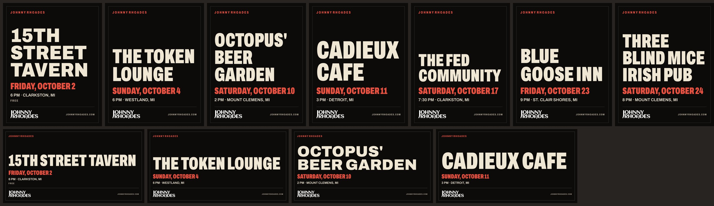

# Case study notes

A running log for the portfolio write-up (PLAN.md section 16): numbers, screenshots and surprises, captured as they happen. Newest first.

---

## 2026-10-02: The show card, after "something classic blues"

**What changed.** Joe wanted something classic blues on the site, "B.B. King or a velvet Jimi Hendrix poster." Rather than borrow their faces, the prototype borrows the form they toured on: the letterpress show card. It has IN PERSON across the top, JOHNNY RHOADES as big as the card allows, and the date in a solid red block, printed on bone stock. It's built from Johnny's real show data, like every other poster. ADR 0017.

**Worth telling**

- *Wood type, computed.* Each line of the name fills the full width, and each line picks its own Archivo width cut, the way a compositor pulled different type from the case. On the feed poster, JOHNNY comes out at 87.5% width and RHOADES at 75%, both about 224 px tall. Nobody chose those numbers; the space did.
- *Texture can hurt legibility.* The first version wore every stroke, and a void across the I in "CLARKSTON, MI" made it read "MI!". The fix copies the site's own rule (wear on display type only) without knowing which text is which: blur the ink, keep only the deep interiors, and wear those. Thin strokes never qualify.
- *Same speed.* A median of 86 ms per render with the texture, against 72 ms for the plain bill.

**Screenshots:** `docs/case-study/show-card-prototype-feed.jpg` (before above, after below) and `show-card-prototype-formats.jpg`.

**Verdict.** Joe, on seeing the prototype: "I like this aesthetic." He chose the card for every format, with Johnny's name biggest on guest spots too.

**Shipping it**

- *The texture tripled the PNG size, so the show page stopped loading the PNG.* Grain doesn't compress: the Instagram post went from 73 KB (the bill) to 171 KB, and palette PNG or WebP only got it to 85–100 KB. The page now inlines satori's own SVG of the same layout, about 16 KB gzipped. That one element is the poster on screen and the printed flyer: vector on white paper, one US Letter page. The textured PNGs stay for posting and link previews. A show page is now lighter than it was with the old poster.
- *A sharp surprise.* `blur().threshold()` in one sharp pipeline runs the threshold first, so "keep only deep interiors" quietly wore every stroke near ink, the 4 px test stroke included. The cut now happens in code after the blur. A unit test draws a heavy block and a 4 px stroke and checks that only the block wears.
- *Ink covers paper.* The first finish laid the paper grain over everything, so fibers showed through black type. Grain now goes on bare stock only, in the same pass as the wear.
- *A flaky test, found by the clock.* The home-page e2e test pinned the build date but not the browser clock. Once tonight's show ended at 9 pm, the hero correctly moved on and the test failed. It now sets the browser clock the way the Tonight tests do.
- *Removed:* the duotone photo slot. It had shipped empty, waiting on photographer credits, and the card has no room for a photo without shrinking the name.

---

## 2026-10-01: Drop the needle, and "am I free that night?"

**What changed.** You can hear the album now. Press play on a song and the tonearm swings onto the spinning record while a 30-second clip plays. And the booking form checks the date as you pick it: "I'm already playing The Fed Community in Clarkston that day." ADR 0016.

**Worth telling**

- *The record was always the right player.* It already spun on the page as decoration; giving it a tonearm made it the control people expect, without adding a new playful element.
- *Honest copy in a small place.* The date check never says "you're in luck, he's free". Johnny plays gigs that never reach Bandsintown, so the most it can truthfully say is "I don't have anything listed that day."
- *Zero bytes until asked.* No audio loads until someone presses play; the whole player is about 1.5 KB.
- *Testing sound without sound.* Playwright's Chromium can't decode AAC, so the tests serve seconds of WAV silence in place of Apple's clips and check everything around the audio: play, pause, switching songs, the needle lifting, failures, and the security policy.

---

## 2026-10-01: Print texture, after "needs texture"

**What changed.** The site looks printed now: screen-printed black, poster-stock bone and red, worn letterpress ink in the big type, and a rough paper edge where the bone and red sections start. Four generated tiles (37 KB), one stylesheet, no new colors. ADR 0015.

**Worth telling**

- *The first draft was a gimmick.* Big blotchy voids in the type looked like a "distressed" font from a template shop. The version that works is roughly a tenth as strong: you see it up close, and from across the room it just feels made.
- *Texture from code, not stock photos.* The tiles come from a seeded noise script, so they're seamless, reproducible, and free of licensing questions.
- *A one-line bug worth remembering.* The torn edge first overlapped the section above by half its height, so wherever the tear dipped deep, a thin line of the page behind showed through. It now overlaps by the full strip.

---

## 2026-10-01: Design pass, after "this website isn't world class"

**What changed.** Same colors, same typeface, same record and strum; different layout. The hero now says where Johnny plays next. Show lists read like a gig listing, with a date block and a bone "ticket" on hover. No more half-empty columns. Booking is a bone section, the mailing list a flat red band, and the photo grid closes square. ADR 0014.

**Before and after:** `docs/case-study/design-pass-before-desktop.jpg` and `design-pass-after-desktop.jpg` (and `-mobile`).

**Worth telling**

- *The critique was layout, not branding.* Every section used the same template: a giant heading over two columns, the left one mostly empty. Breaking that pattern did more than any new color or font would have, and none were added.
- *The most useful sentence on a gigging musician's site is "next show: Friday, 15th Street Tavern."* It was a full scroll down. Now it's under his name, and it updates itself when the show ends.
- *Lighter as well as better:* home page Lighthouse 96 to 97, 345 KB to 321 KB.

---

## 2026-09-30: Phase 7 prep, before touching anything

**What changed.** Nothing live. The launch is written down step by step (`docs/runbook-launch.md`) with a ten-minute rollback, the old site's URLs are mapped, and a script checks the redirects after cutover.

**Worth telling**

- *Look before you move.* Two public lookups changed the plan. The DNS was already on Cloudflare, so the "move DNS" step became "find out whose account it's on." And the MX records point at Zoho: Johnny has email on the domain. The plan's free Cloudflare Email Routing for `booking@` would have replaced those records and silently cut off his mailbox. `booking@` becomes a Zoho alias instead.
- *The old site was smaller than assumed.* Bandzoogle served seven URLs: the root, `/home` and five track pages. The pages the plan guessed at (`/music` and so on) were already 404s. Six redirect rows, one wildcard rule.

---

## 2026-09-30: Phase 6, hardening

**What changed.** The site now tells crawlers and answer engines what's there (a sitemap that follows the show data, a welcoming robots.txt, an `llms.txt` written from the facts ledger) and pings IndexNow after each deploy with only the show pages that changed. A Content Security Policy for Cloudflare is drafted and tested by serving the whole site under it. Lighthouse CI, html-validate and link checks run on every pull request.

**Lighthouse (mobile, local build, median of three)**

| Page | Performance | Accessibility | Best practices | SEO |
|---|---|---|---|---|
| Home | 96 | 100 | 100 | 100 |
| Show page | 100 | 100 | 100 | 100 |
| Press kit | 97 | 100 | 100 | 100 |

Home ships 10 KB of JavaScript (budget 30 KB) and 345 KB in total (budget 600 KB).

**Worth telling**

- *Measuring found what reading didn't.* The home page had no Largest Contentful Paint at all: the hero photo faded in from invisible, and Chrome doesn't count invisible things. Lighthouse couldn't score it. The photo now settles from a slight zoom instead, visible from the first frame.
- *A banner that moved the page.* Past show pages revealed "This show has happened" with script, every time, shifting everything below it (CLS 0.11). The build already knew; now the HTML says it. CLS 0.
- *27 KB nobody would miss.* The font covered widths up to 125%; the site never goes past 100%. Trimming the axis took it from 90 KB to 63 KB, pixel-identical at every width and weight in use.
- *The analytics host that wasn't.* Umami's script loads from one host and reports to another. A CSP written from the docs would have quietly blocked every event; the test that serves the site under the real policy is what makes that kind of mistake loud.

---

## 2026-09-30: Phase 5, forms, mailing list and analytics

**What changed.** Both forms were wired to Netlify Forms in v1, which does nothing on GitHub Pages: every booking request would have vanished without an error. Booking now goes through Web3Forms, signups through Buttondown, and Umami counts visits and eleven events without cookies or a banner.

**Worth telling**

- *The subject line is the feature.* A booking lands as `Booking: Sat, Oct 24, Blue Goose Inn, St. Clair Shores, Bar / club`, with reply-to set to the booker, so Johnny can decide from the lock screen whether it's worth a reply tonight.
- *ZIP to region.* A signup with a ZIP gets a region tag (Metro Detroit, Ann Arbor, Lansing, West Michigan...) so a Lansing show can be announced to Lansing people only. The raw ZIP is kept, so the map can be redrawn.
- *Tracking that costs almost nothing.* Most events are HTML attributes Umami reads itself. The site's own tracking code is about 100 bytes gzipped, and does nothing when Umami isn't there.
- *Public on purpose.* The three service IDs end up in the page anyway, so they're build variables, not secrets, and the site builds and degrades politely without them.

**Numbers.** 162 unit tests and 34 end-to-end tests. The end-to-end tests intercept Web3Forms and Buttondown, so the whole path up to the network is checked without sending anything. Form script: 1.7 KB gzipped, loaded with the page.

---

## 2026-09-30: Phase 4, the press kit and the facts ledger

**What changed.** `/epk/` is the link Johnny pastes into booking emails. It has a live video, bios in two lengths with copy buttons, fast facts with source links, four sourced highlights, recent and upcoming rooms from the show data, logo downloads and an FAQ, and it prints to two pages. Underneath, every claim about Johnny on the site now comes from a ledger with a status. A check script and the build both refuse to put a claim where its status isn't allowed.

**The ledger in numbers.** 14 facts: 4 verified, 8 from Johnny's own bio, 2 unverified. 30 uses across the home page, the press kit and the structured data are checked on every `npm run check`. 145 unit tests and 27 end-to-end tests, one of which scans every built page for unverified claims.

**Worth telling**

- *Research turned up more than the plan had.* Checking the plan's sources found Johnny on the Anti-Freeze Blues Festival bill (2017), a Cliff Bell's headline (2017), and a 2010 blog naming him in Motor City Josh's band. Each is now a sourced line in the press kit.
- *A rule with teeth removed a line from the home page.* The Detroit Music Award nomination has no year, category or listing anywhere online, so it's `unverified`, and the About section no longer says it. One data change brings it back when Johnny can source it.
- *Rights before reach.* Two photos carry photographer watermarks. The press kit shows photos but won't offer high-resolution downloads until credits and licenses are confirmed, and the data schema enforces that.

---

## 2026-09-30: Phase 3, the poster engine

**What changed.** Every show now has gig posters made from type: a link preview for every show page, and square, 4:3, 16:9, Instagram post and Story sizes for upcoming ones. The venue name is the hero, set as big as it fits. Short names run wide across Archivo's width axis, and long ones run condensed and stacked. Show pages display the poster, offer downloads, and print as a one-page US Letter flyer.

**Numbers.** 44 posters for the current calendar, 40–90 ms each to render, about 1 ms each from cache on rebuild. Nine shows' worth of posters adds about 1.5 s to a cold build. 129 unit tests (30 for posters, including ten pixel snapshots) and 20 end-to-end tests, one of which prints the flyer to PDF and checks it's a single page.

**Worth telling**

- *Measure, don't guess.* Satori can't fit text to a box, so the layout measures every candidate (six widths × every line break) with the same font files satori renders. Then a test can promise that no venue name, however long, overflows any format.
- *The snapshot review earned its keep.* The first cancelled-show design put a red band across the poster, and looking at the snapshots showed it covering the date. Now CANCELLED replaces the billing line and nothing is hidden.
- *Photos wait on rights, not code.* The duotone photo version (`case-study/phase-3-poster-photo-option.jpg`) is built and tested but switched off until Johnny confirms who took the photos.

---

## 2026-09-30: Phase 2, shows on the site

**What changed.** The Bandsintown widget is gone. Shows are rendered at build time from `shows.json`, and every public show gets its own page with event markup, a calendar file and directions. `/shows/` adds the full list and archive. `/shows.ics`, `/shows/feed.xml` and `/shows.json` are generated alongside. On a show day, a red "Tonight" bar appears under the hero.

**Lighthouse, mobile, median of 3** (same setup as Phase 0):

| | Performance | Accessibility | Best practices | SEO | LCP | TBT | Weight |
|---|---|---|---|---|---|---|---|
| v1 prototype | 63 | 97 | 100 | 100 | 7.99 s | 172 ms | 1,150 KB |
| Phase 0 | 71 | 100 | 100 | 100 | 7.04 s | 258 ms | 1,001 KB |
| **Phase 2, home** | **95** | 100 | 100 | 100 | 2.86 s | 0 ms | 366 KB |
| **Phase 2, a show page** | **100** | 100 | 100 | 100 | 1.81 s | 0 ms | 160 KB |

Removing one third-party widget (and the Google Tag Manager it brought along) did more for performance than everything else combined. Home LCP is still above the plan's 2.0 s bar, which is Phase 6 work (the hero image).

**Tests.** 99 unit tests and 17 end-to-end tests. Playwright's clock control checks the time-dependent behavior in a real browser: the Tonight bar appears at 7:30 pm on a show day and disappears after the set, and a past show's page points to the next one. The generated calendar is checked by a real iCalendar parser (Mozilla's ical.js), not just string matching.

**Worth telling**

- *Two numbers that look the same but aren't.* "When is a show over?" (4 hours, for hiding it) and "how long is it?" (3 hours, only because calendar apps need an end time) are separate constants, and neither is ever shown as a fact.
- *Static hosting picks MIME types from file extensions,* so the RSS feed is served as `text/xml` no matter what the endpoint declares. A test caught that assumption.

---

## 2026-09-30: Phase 1, show data pipeline (on mock data)

**What changed.** `scripts/sync-shows.ts` turns Bandsintown events into `src/data/shows.json`. Every show gets a stable slug, a venue-local time with a real UTC offset, an act, a billing line and history fields. The workflow runs it every three hours and commits only when something changed.

**The blocker, handled.** Bandsintown's API needs an `app_id` from Johnny's artist account, and we don't have one yet. Instead of waiting, the pipeline was built against a faithful mock (ADR 0006): Johnny's real public schedule and real event IDs, in the exact JSON shape Bandsintown returned for one of his shows. When the key arrives, `npm run sync -- --capture` records real responses to diff against.

**Numbers.** 79 unit tests in about 2 seconds. They include both 2026–27 DST changes, Bandsintown error bodies, a matinee-plus-evening slug collision, and an integration test that runs the real script against temp data. The script writes nothing on a no-change run, so the 3-hourly schedule makes zero commits on quiet days.

**Things worth telling**

- *Bandsintown times have no offset.* "2026-10-02T18:00:00" means 6 pm wherever the venue is. Treating every show as Detroit time would put a Chicago gig an hour off, so the venue's time zone is stored with every show.
- *Johnny doesn't label his shows today.* Every real event has an empty title, so every show reads as "Johnny Rhoades" with no act. The fix is a one-page guide for Johnny (`docs/bandsintown-naming.md`), not code.
- *Keeping the scheduled workflow alive.* GitHub disables scheduled workflows in public repos after 60 days without activity. A quiet calendar would kill the sync, so a weekly heartbeat commit keeps it alive. It's tested.

---

## 2026-09-30: Phase 0, scaffold with visual parity

**What changed.** The one-page prototype is now an Astro 7 site, with TypeScript strict, components, an image pipeline and self-hosted fonts. To a visitor it looks exactly the same.

**Parity.** Full-page screenshots of v1 and v2 match at 390, 768 and 1440 px: 0.000% of non-photo pixels differ, and page heights are identical (11,019 / 9,246 / 8,050 px). See ADR 0005 for how photos are handled.

**Lighthouse, mobile, median of 3 runs** (local preview, Lighthouse 13.5, simulated slow 4G):

| | Performance | Accessibility | Best practices | SEO | FCP | LCP | TBT | Weight |
|---|---|---|---|---|---|---|---|---|
| v1 prototype | 63 | 97 | 100 | 100 | 4.09 s | 7.99 s | 172 ms | 1,150 KB |
| v2 Phase 0 | 71 | 100 | 100 | 100 | 1.36 s | 7.04 s | 258 ms | 1,001 KB |

Not yet measured: the live Bandzoogle site (PLAN.md section 13 wants it as the "before"). Capture it before launch.

**Where the remaining weight is.** The Bandsintown widget script is 432 KB transferred, and **it quietly loads Google Tag Manager** (another 138 KB) on Johnny's page. Together they're well over half the page weight and most of the blocking time. Phase 2 renders shows at build time and drops both. That's a privacy win as well as a speed one, and a good line for the write-up.

**JavaScript.** 4.6 KB gzipped of first-party JS on load, plus a 2.7 KB strum chunk that loads later. The budget is 30 KB.

**Surprises worth telling**

- *The accessibility check found a real bug in the "finished" design.* Bone text on the red buttons was 4.45:1, a hair under WCAG AA, and the hover state was about 3:1. Fixed with a slightly deeper red that nobody will notice (ADR 0003).
- *Pixel parity failed on a one-pixel rounding error.* A photo master capped at 1600px resized to 700×466 instead of 700×467. That shifted everything below it by a fraction of a pixel and changed text anti-aliasing down the page. Rebuilding two masters from the originals took the diff from 0.7% to 0.000% (ADR 0005).
- *Astro ships full-size originals if your code reads a property off an imported image.* Reading `photo.width` in the gallery added 3 MB of unreferenced JPEGs to the build. Removing it took the build from 7.0 MB to 4.0 MB.
- *Toolchain edges in late 2026:* npm 10.9 crashes installing this dependency tree, TypeScript 7 isn't supported by `@astrojs/check` yet, and `astro preview` in Astro 7 runs as a background daemon with a lock file, so test runners need `--ignore-lock` (ADR 0004).

**Screenshots to keep:** `test-results/parity-home-matches-v1-at-*/` (v1, v2 and diff images, regenerated by `npm run test:e2e`).
